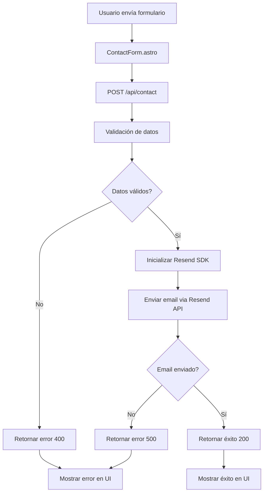

# Plan de Integración: Resend API para Formulario de Contacto

## 📋 Resumen Ejecutivo

Este plan detalla la integración de **Resend API** para enviar los datos del formulario de contacto por correo electrónico. Los datos capturados (nombre, email, teléfono, tipo de servicio y mensaje) se enviarán a una dirección de correo específica cuando el usuario envíe el formulario.

## 🎯 Objetivos

1. **Capturar datos del formulario**: Recibir todos los campos del formulario en el endpoint API
2. **Enviar email vía Resend**: Utilizar Resend Node.js SDK para enviar un email con los datos del formulario
3. **Seguridad de API Keys**: Almacenar las credenciales de Resend en variables de entorno
4. **Manejo de errores**: Implementar validación y manejo de errores robusto

## 📊 Arquitectura del Flujo de Datos



## 🔧 Requisitos Técnicos

### Dependencias Necesarias

| Paquete | Versión | Propósito |
|---------|---------|-----------|
| `resend` | Latest | SDK de Resend para Node.js |

### Variables de Entorno

| Variable | Descripción | Ejemplo |
|----------|-------------|---------|
| `RESEND_API_KEY` | API Key de Resend para autenticación | `re_xxxxxxxxxxxxx` |
| `RESEND_FROM_EMAIL` | Email remitente verificado en Resend | `noreply@tudominio.com` |
| `RESEND_TO_EMAIL` | Email destino para recibir los formularios | `contacto@tudominio.com` |

## 📝 Estructura del Email

El email enviado contendrá la siguiente información:

### Asunto
```
Nuevo contacto de [Nombre] - [Tipo de Servicio]
```

### Contenido (Formato HTML)
```html
<h2>Nuevo contacto recibido</h2>

<p><strong>Nombre:</strong> [Nombre]</p>
<p><strong>Email:</strong> [Email]</p>
<p><strong>Teléfono:</strong> [Teléfono]</p>
<p><strong>Tipo de Servicio:</strong> [Tipo de Servicio]</p>

<h3>Mensaje:</h3>
<p>[Mensaje del usuario]</p>

<hr>
<p><em>Enviado desde el formulario de contacto del sitio web</em></p>
<p><em>Fecha: [Timestamp]</em></p>
```

## 🔄 Flujo de Implementación

### Paso 1: Configuración de Variables de Entorno

**Archivo: `.env`**
```env
RESEND_API_KEY=re_xxxxxxxxxxxxx
RESEND_FROM_EMAIL=noreply@tudominio.com
RESEND_TO_EMAIL=direccionsucursalmedellin@gmail.com
```

**Archivo: `.env.example`**
```env
RESEND_API_KEY=
RESEND_FROM_EMAIL=
RESEND_TO_EMAIL=
```

### Paso 2: Instalación de Dependencias

```bash
npm install resend
```

### Paso 3: Modificación del Endpoint API

**Archivo: `src/pages/api/contact.ts`**

Cambios principales:

1. **Importar Resend SDK**
```typescript
import { Resend } from 'resend';
```

2. **Inicializar Resend con API Key**
```typescript
const resend = new Resend(import.meta.env.RESEND_API_KEY);
```

3. **Construir y enviar email**
```typescript
const { data, error } = await resend.emails.send({
  from: import.meta.env.RESEND_FROM_EMAIL,
  to: import.meta.env.RESEND_TO_EMAIL,
  subject: `Nuevo contacto de ${name} - ${serviceType}`,
  html: emailBody,
});
```

### Paso 4: Manejo de Errores

Implementar validación de:
- Datos del formulario incompletos
- Formato de email inválido
- Errores de la API de Resend
- API Key no configurada

## 🛡️ Consideraciones de Seguridad

1. **API Keys en variables de entorno**: Nunca hardcodear credenciales en el código
2. **Validación de datos**: Validar todos los campos antes de procesar
3. **Rate limiting**: Considerar implementar rate limiting para prevenir abuso
4. **Sanitización**: Sanitizar el contenido HTML del email para prevenir XSS

## 📦 Campos del Formulario

| Campo | Tipo | Requerido | Descripción |
|-------|------|-----------|-------------|
| `name` | string | Sí | Nombre completo del contacto |
| `email` | string | Sí | Correo electrónico del contacto |
| `phone` | string | Sí | Número de teléfono |
| `serviceType` | string | Sí | Tipo de servicio (turismo, empresarial, salud, escolar, otro) |
| `message` | string | Sí | Mensaje del contacto |

## ✅ Criterios de Éxito

- [ ] El formulario envía los datos correctamente al endpoint API
- [ ] El endpoint valida todos los campos requeridos
- [ ] Se envía un email a la dirección destino con todos los datos
- [ ] El email tiene formato HTML legible
- [ ] Se manejan errores apropiadamente (validación, API errors)
- [ ] La UI muestra mensajes de éxito/error apropiados
- [ ] Las API keys están almacenadas en variables de entorno
- [ ] El código sigue las mejores prácticas de seguridad

## 🧪 Plan de Pruebas

1. **Prueba de validación**: Enviar formulario con campos incompletos
2. **Prueba de email inválido**: Enviar con formato de email incorrecto
3. **Prueba de envío exitoso**: Enviar formulario completo
4. **Prueba de error de API**: Simular error de Resend (API key inválida)
5. **Prueba de formato de email**: Verificar que el email recibido tenga el formato correcto

## 📚 Referencias

- [Resend Node.js SDK Documentation](https://github.com/resend/resend-node)
- [Resend API Documentation](https://resend.com/docs/api-reference/emails/send-email)
- [Astro API Routes](https://docs.astro.build/en/guides/endpoints/)

## 🚀 Próximos Pasos

Una vez implementada la integración básica, considerar:

1. **Almacenar en Strapi**: Guardar los formularios en el CMS para histórico
2. **Email de confirmación**: Enviar email de confirmación al usuario
3. **Attachments**: Permitir adjuntar archivos al formulario
4. **Webhooks**: Configurar webhooks de Resend para tracking de emails
5. **Analytics**: Implementar tracking de envíos de formularios
